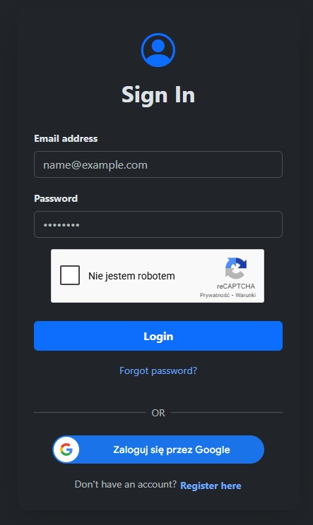
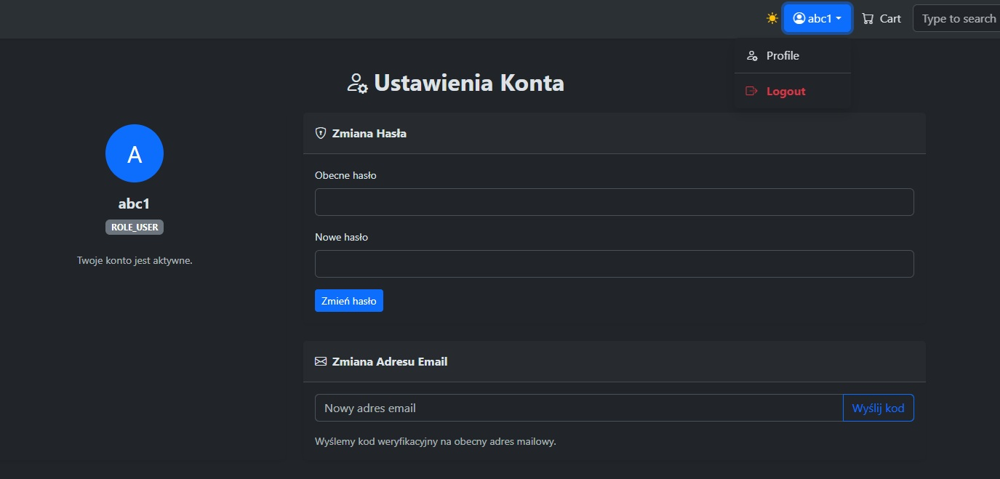
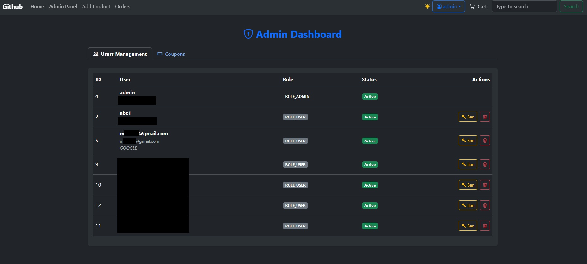
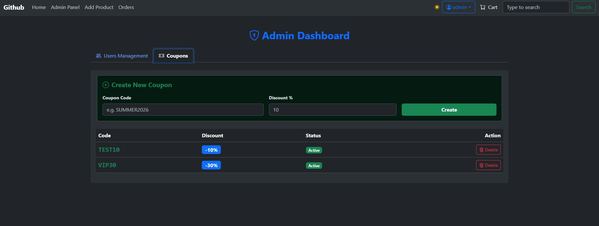

# 🛒 R6Customs - Fullstack E-commerce Platform


## 🌐 Live Demo
Check out the live application here: **[https://r6customs.pl](https://r6customs.pl)**

> **Note:** The application is hosted on a private self-managed VPS. Availability may be limited during late night hours (CET).

---

## 📖 Project Overview
**R6Customs** is a robust, full-stack e-commerce application designed to simulate a real-world shopping experience. Built with a **Spring Boot** backend and a **React** frontend, it features a complete microservice-ready architecture containerized with **Docker**.

The project demonstrates advanced security implementations, including **JWT authentication**, **OAuth2 (Google Login)**, and **Google ReCAPTCHA v2**, all deployed securely behind a **Cloudflare Zero Trust Tunnel** to ensure SSL encryption and traffic protection without exposing public ports.

---

## 🚀 Key Features

### 🔐 Security & Authentication
* **JWT & OAuth2:** Hybrid authentication system supporting standard email/password login (with JWT tokens) and Social Login via **Google OAuth2**.
* **Role-Based Access Control:** Secured endpoints for Users and Admins using Spring Security.
* **Bot Protection:** Integration with **Google ReCAPTCHA v2** on login/registration forms to prevent automated attacks.
* **HTTPS/SSL:** Fully encrypted traffic managed by Cloudflare Edge Certificates.

### 🛍️ E-commerce Functionality
* **Product Catalog:** Dynamic product fetching with pagination and categorization.
* **Shopping Cart:** Persistent cart management stored in the database (synchronized across devices).
* **Order System:** Complete checkout flow, address management, and order history tracking.
* **User Profile:** Ability to manage account details and view past activity.

### 🏗️ Architecture & DevOps
* **Dockerized Environment:** The entire stack (Frontend, Backend, Database, Cloudflare Tunnel) is orchestrated via `docker-compose`.
* **Cloudflare Tunnel:** The application runs on a private network; traffic is routed securely via Cloudflare Tunnel (Zero Trust), eliminating the need for port forwarding or public IPs.
* **CI/CD Friendly:** `Dockerfile` configurations optimized for multi-stage builds.

### 👮 Admin & Store Management
* **Admin Dashboard:** A dedicated, secured interface for store administrators to oversee platform activity.
* **User Management:** Full control over registered users, including the ability to **ban/unban** accounts for security violations.
* **Marketing & Promotions:** Dynamic **Coupon System** allowing admins to create discount codes (percentage or fixed amount) with expiration dates.
* **Product Management:** interfaces for adding, editing, and removing products from the catalog.
---

## 🛠️ Tech Stack

### Backend
* **Language:** Java 17+
* **Framework:** Spring Boot 3
* **Security:** Spring Security, JWT (Json Web Token), OAuth2 Client
* **Database:** PostgreSQL
* **ORM:** Hibernate / Spring Data JPA
* **API Documentation:** Swagger UI / OpenAPI

### Frontend
* **Framework:** React.js (Vite)
* **Styling:** Bootstrap 5 (Custom Theming) & CSS Modules
* **State Management:** React Context API
* **HTTP Client:** Axios (with Interceptors for token refresh)
* **Security:** ReCAPTCHA React Component

### Infrastructure
* **Containerization:** Docker & Docker Compose
* **Reverse Proxy / Tunnel:** Cloudflare Tunnel (cloudflared)
* **Hosting:** Self-hosted VPS (Virtual Private Server)

---

## 📸 Screenshots

### 🛒 Customer Experience
Explore the seamless shopping journey available in the live demo.

| Login | User Panel |
|:---:|:---:|
|  |  |

### ⚙️ Admin Dashboard (Restricted Access)
*Note: For security reasons, administrative features are disabled in the public live demo. Below is a preview of the backend management capabilities.*

| Admin Panel & User Banning | Coupon Management |
|:---:|:---:|
|  <br> *Managing users and banning suspicious accounts* |  <br> *Creating and managing discount codes* |

---

## ⚙️ Installation & Local Setup

### Prerequisites
* Node.js & npm
* Java JDK 17+
* Docker & Docker Compose
* PostgreSQL

### 1. Clone the Repositories
```bash
git clone https://github.com/rafals/SpringEcom-backend.git
git clone https://github.com/rafals/SpringEcom-frontend.git
